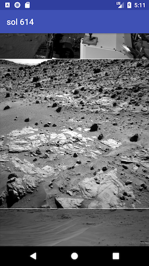
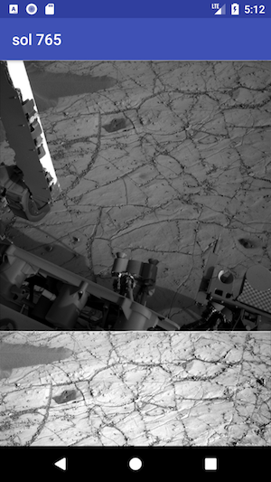

# MarsRoverPhotos
A demo on using retrofit, glide and gson in Kotlin

## The app
MarsRoverPhotos is a simple demo app to illustrate using retrofit to make api calls as well as use glide to load images from urls

## Screenshots

 